<div align="center">

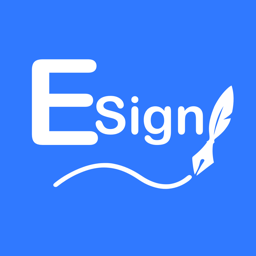

# 易能签 EnSIgn

**iOS 上的一体化签名工具 —— 签名、注入、软件源、文件管理，一个 App 全搞定**<br>
**并且支持一键自动更新，装上之后不用再手动重签**

简体中文 · [English](README.en.md)


**📦 未签名原包** → [pan.enqapp.com](https://pan.enqapp.com/)<br>
**🚀 在线签名安装** → [www.enqapp.com/install](https://www.enqapp.com/install)

### 加入社区

[](https://qun.qq.com/universal-share/share?ac=1&authKey=Pifbfqrq5x%2FgEZmQNlaU8DbgJyQeJga5hu9gaZTONxOIWgG7jaXr%2FMgydVWuzynv&busi_data=eyJncm91cENvZGUiOiI5NjIzMzc1MjMiLCJ0b2tlbiI6InlaUno4LzJvY2VBWXpEMVE1aXBlb082MTVlTFB1VUhlaitnQW5aYlhJaW1kM25VYUNBc0gvS0hhSFlIMGZPcEIiLCJ1aW4iOiIzMTIwNjE1NDM2In0%3D&data=0jUZUSdflWEWXWmg6l4vwK1HxgDpDhjqGumH32eKbuZ-X-ZyixgBbU4JELb-NdJwacP7EBYDP3KkQgY6Se6uhw&svctype=4&tempid=h5_group_info)
[](https://pd.qq.com/s/bceanzrgg?b=9)
[](https://t.me/tbox_Sign)
[](https://t.me/tbox798)

[自动更新](docs/auto-update.md) · [功能清单](docs/features.md) · [URL Scheme](docs/url-scheme.md) · [快速上手](docs/getting-started.md) · [常见问题](docs/faq.md) · [版本演进](docs/changelog.md)

</div>

---

## 这是什么

易能签（EnSIgn）是一款运行在 iPhone / iPad 上的**本地签名工具**。它把「重签名一个 IPA」需要的全部环节都装进了一个原生 App：导入证书、修改应用信息、注入插件、执行签名、安装到设备，以及后续的文件管理与更新。

不需要电脑，不需要越狱。装上它，一部手机就能完成从拿到安装包到装进桌面的全过程。

易能签的设计受**轻松签**启发，从文件导入、证书管理，到签名流程与安装反馈，操作逻辑都尽量贴近老用户已经熟悉的那一套 —— 目标是换过来的人不用重新学一遍。

<div align="center">
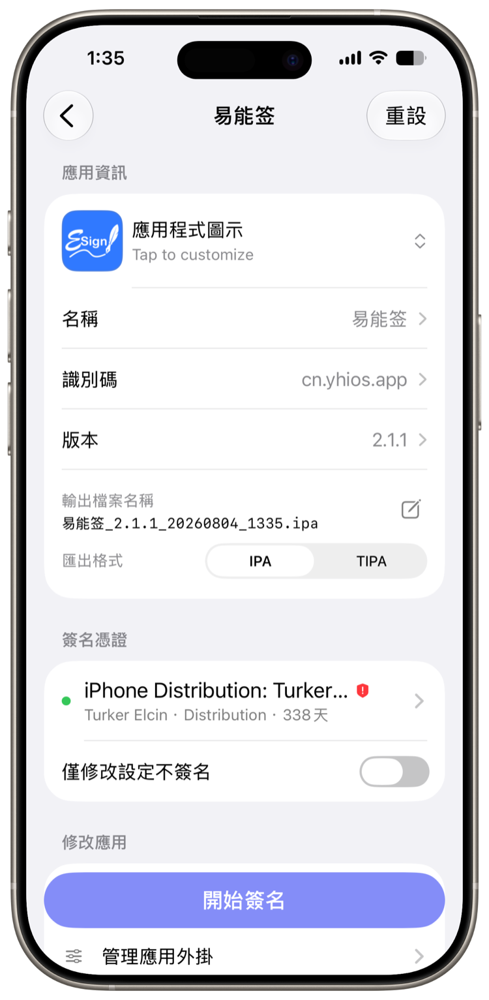 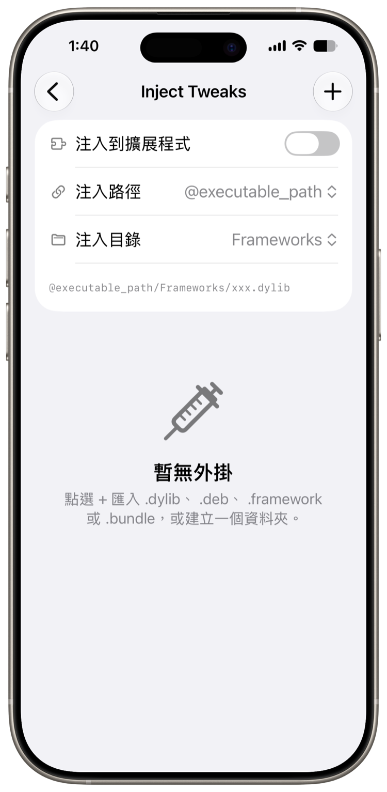 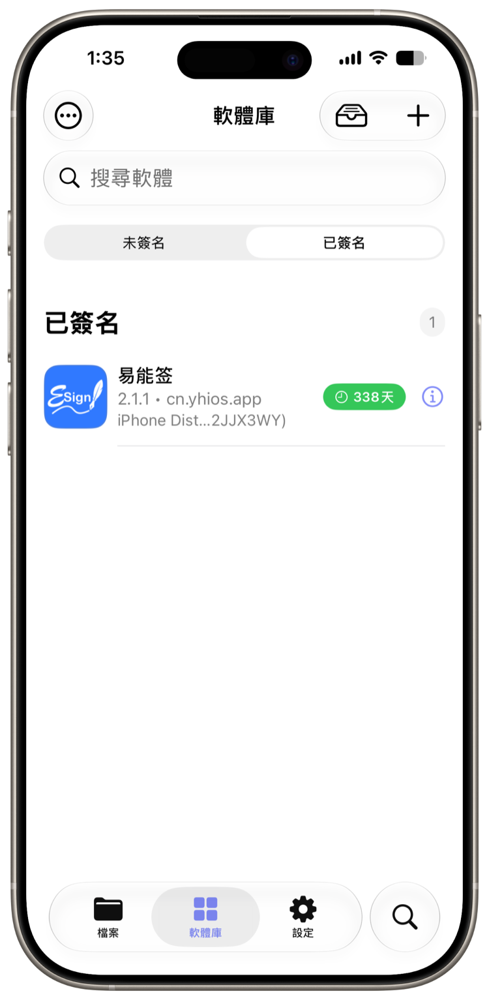
</div>

---

## ⭐ 一键自动更新

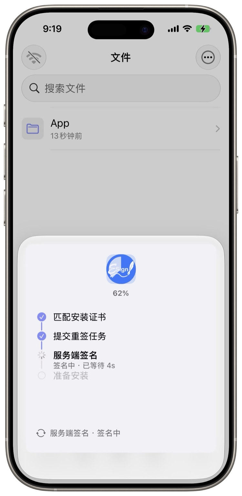

自签装上的应用没有 App Store 更新通道，传统做法是每次都手动重走一遍：找新包 → 导入 → 选证书 → 重签 → 再装。

**易能签把这串流程收成了一次点击。**

```
自动匹配安装时用的证书 → 提交重签任务 → 服务端签名 → 准备安装
```

- **完全免费** —— 用自己的证书，还是用易能签提供的开发者证书，一视同仁
- **证书自动匹配** —— 不用回想当初用了哪一张，也不用重新导入
- **不会重复排队** —— 重复提交复用已有任务；队列繁忙会明确提示稍后重试
- **与本地签名互不影响** —— 日常给第三方 IPA 签名仍是纯本地流程，不上传任何东西

在同类签名工具里，自动更新是为数不多的体验分水岭。详见 **[自动更新说明 →](docs/auto-update.md)**

<br clear="right">

---

## 核心能力一览

| 模块 | 能做什么 |
|---|---|
| **自动更新** | 一键完成「匹配证书 → 重签 → 安装」，完全免费，不用手动重签 |
| **签名** | Zsign 内核本地重签名，支持 p12 + 描述文件、Ad-hoc、仅改配置不签名；输出 IPA / TIPA |
| **改包** | 应用名 / Bundle ID / 版本号 / 图标替换，Info.plist 键值级编辑，App 多开 |
| **插件注入** | dylib / deb / framework 注入，越狱依赖自动收敛到 ElleKit，缺失依赖降级弱链接 |
| **证书管理** | p12、描述文件、ZIP 证书包导入；吊销与到期检测；云端恢复；URL Scheme 一键导入 |
| **软件库** | 已签名 / 未签名分栏管理，批量导入与删除，本地 HTTPS 安装服务，扫码安装 |
| **软件源** | 兼容 AltStore / ESign 源格式，**支持全能签软件源（未加密）**，公告、筛选、搜索、离线缓存 |
| **文件管理** | 完整文件浏览器，多格式解压，电脑浏览器无线传输，内置下载器 |
| **编辑器** | 代码 / 文本编辑器（语法高亮）、Plist 编辑器、Hex 编辑器、Assets.car 解析预览 |
| **系统集成** | 灵动岛与锁屏实时进度、「打开方式」导入、URL Scheme、Face ID 锁 |

功能细节见 **[完整功能清单 →](docs/features.md)**

---

## 界面预览

<div align="center">

| 签名 | 插件注入 | 签名进度 |
|:---:|:---:|:---:|
|  |  | 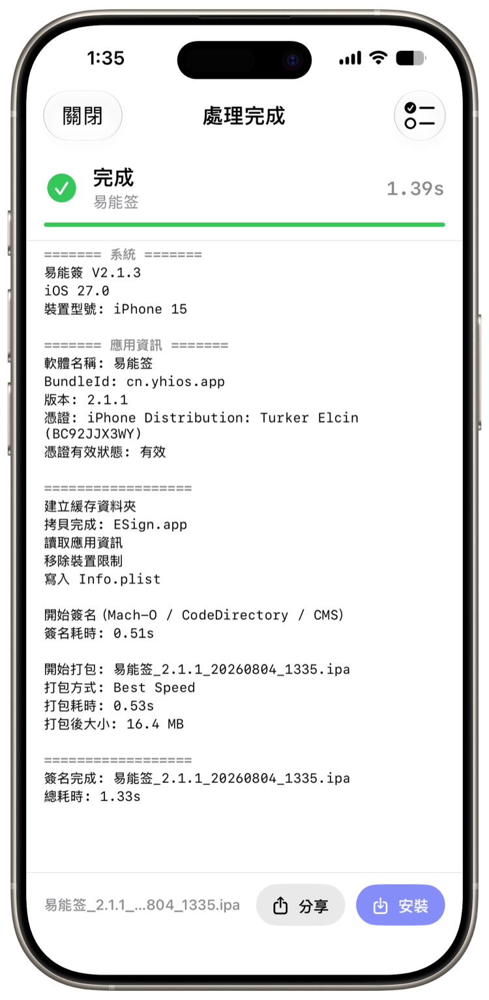 |

| 软件库（已签名） | 软件库（未签名） | 软件源 |
|:---:|:---:|:---:|
|  | 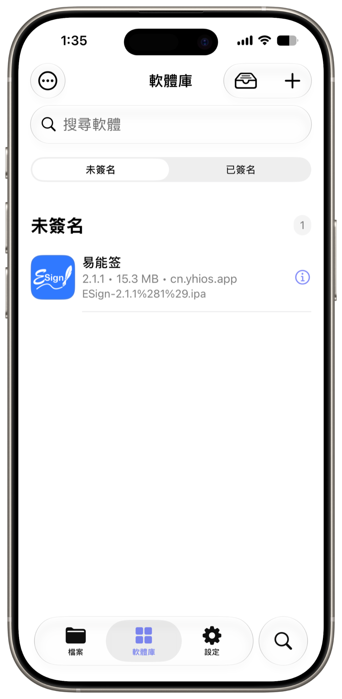 | 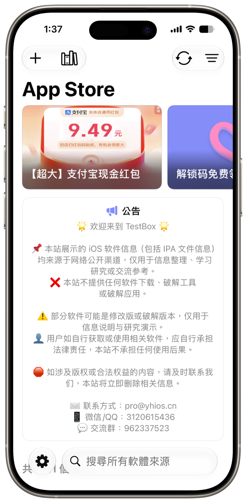 |

| 文件管理器 | Plist 编辑器 | Assets 解析 |
|:---:|:---:|:---:|
| 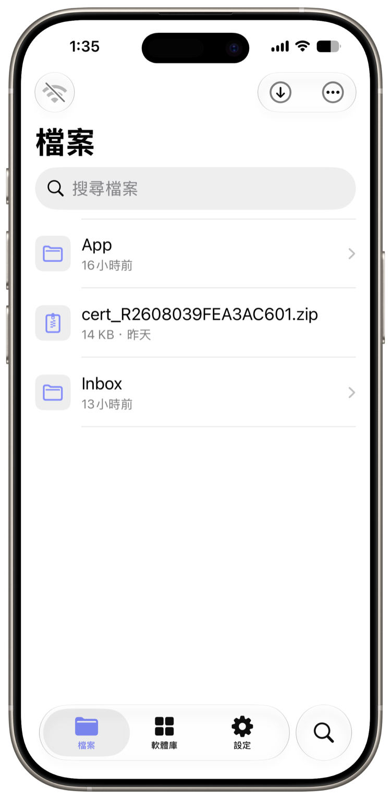 | 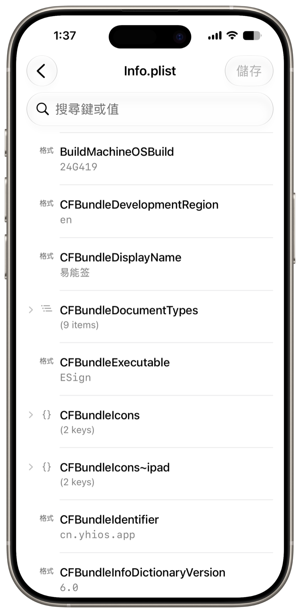 | 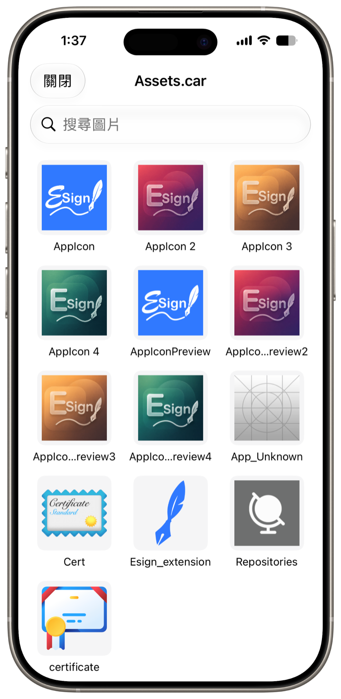 |

| 设置 | 签名配置 | 外观主题 |
|:---:|:---:|:---:|
| 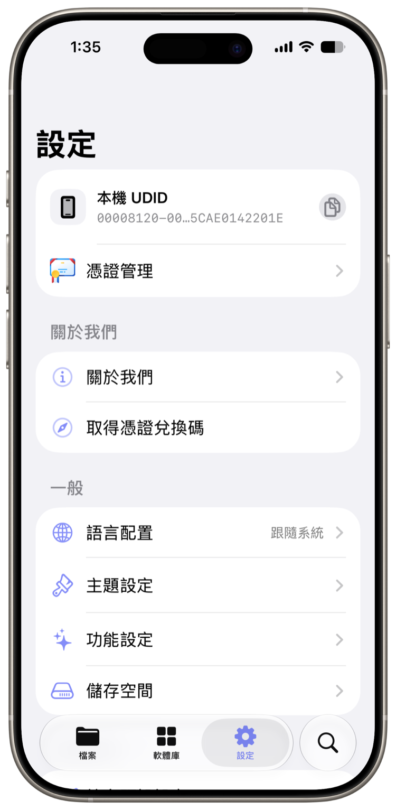 | 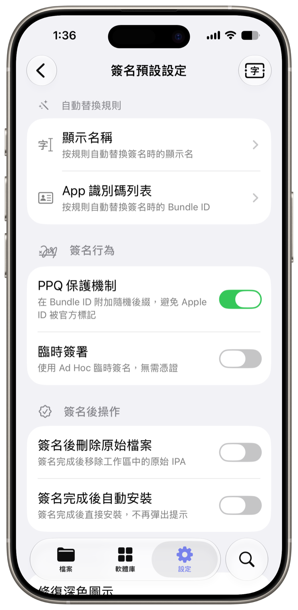 | 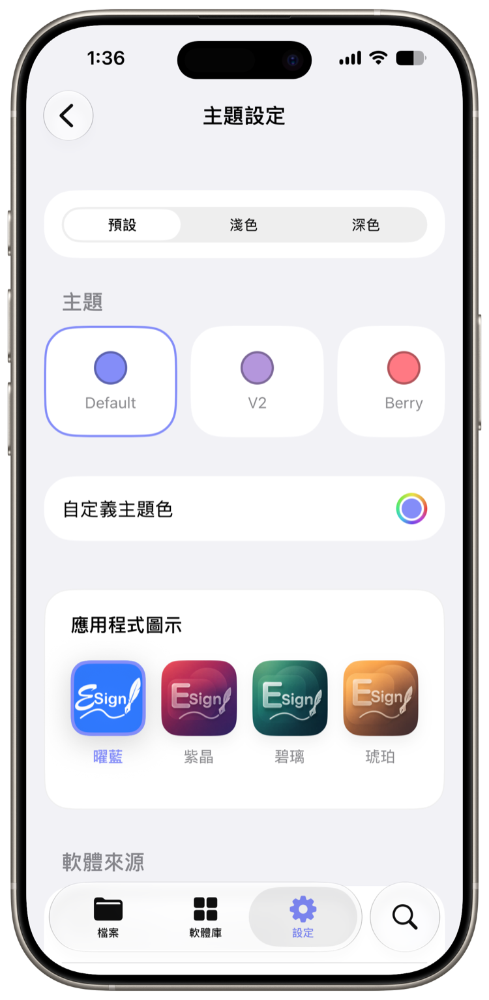 |

</div>

更多截图见 [screenshots/](screenshots/)

---

## 快速上手

1. **装好易能签** —— 从 [在线签名安装](https://www.enqapp.com/install) 直接装，或到 [未签名原包](https://pan.enqapp.com/) 下载后自行签名
2. **导入证书** —— 设置 → 证书，选择 p12 + 描述文件，或从 ZIP 证书包导入
3. **拿到安装包** —— 从软件源下载、内置下载器抓取、或从别的 App「拷贝到易能签」
4. **签名** —— 在软件库里选中未签名的包 → 签名 → 按需调整应用信息与插件 → 开始
5. **安装** —— 签完自动拉起安装，或在已签名列表里点安装 / 扫码装到另一台设备

> iOS 16 及以上需要按系统要求**开启开发者模式**，并在「设置 → 通用 → VPN 与设备管理」中信任对应证书，签名后的应用才能运行。

详细步骤与常见坑见 **[快速上手指南 →](docs/getting-started.md)**

---

## 它适合谁

- **普通 iOS 用户** —— 管理个人 IPA 文件、安装自用测试应用，减少对电脑流程的依赖
- **开发者 / 测试人员** —— 快速验证开发版本、分发内测包，检查证书、描述文件与安装状态
- **进阶用户** —— 应用资源调整、插件测试、文件替换、软件源管理，以及多账号场景下的应用副本区分

> 长期使用建议准备个人开发者证书或独享 P12 证书。共享证书可以用来体验，但稳定性通常较低，可能出现过期、撤销或设备不匹配的情况。

---

## 系统要求

- iOS / iPadOS **16.0 及以上**，已适配至最新系统（灵动岛实时活动需 16.2+）
- 机型：**iPhone 8 及以上**，同时支持 iPad
- **不需要越狱**
- 需要一张有效的签名证书（个人开发者证书、企业证书均可）
- 界面语言：**简体中文 / 繁體中文 / English / Tiếng Việt（越南语）**，四语完整本地化，随时切换

### 四款内置图标，可自由切换

<div align="center">
 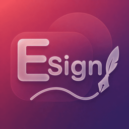 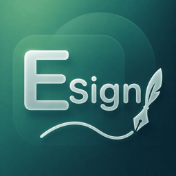 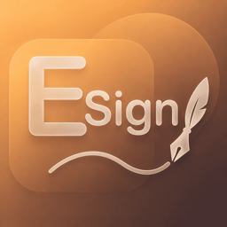

曜蓝 · 紫晶 · 碧璃 · 琥珀
</div>

---

## 文档

- [自动更新说明](docs/auto-update.md) —— 重点功能，它怎么工作、隐私边界在哪
- [完整功能清单](docs/features.md) —— 每个模块能做什么，逐条列清楚
- [URL Scheme 使用指南](docs/url-scheme.md) —— 添加软件源、下载资源与一键导入证书
- [快速上手指南](docs/getting-started.md) —— 从零到装上第一个 App
- [常见问题](docs/faq.md) —— 签名失败、装不上、闪退怎么排查
- [版本演进](docs/changelog.md) —— 从 1.x 到 2.1.x 都做了什么

---

## 隐私说明

- **日常签名全程在设备本地完成**，证书与安装包不出手机
- **自动更新**是唯一需要服务端参与的通道（服务端重签），产物定时清理，请求全程 ECDSA 验签；不使用这条通道时，走本地签名即可
- 崩溃采集、设备统计等任何数据上报，都在**你同意隐私政策之后**才会启动
- 证书密码经加密后存储，不落明文；日志不会输出 UDID 与证书密码

---

## 给开发者 / 证书商

易能签开放了**一键把证书导入 App** 的接口（URL Scheme `enq-app://`）。完整格式、参数和网页示例见 **[URL Scheme 使用指南](docs/url-scheme.md)**；App 内 **设置 → 关于我们 → URL Scheme** 还可以一键「复制 AI 对接文档」，把完整规范交给 AI 帮你写接入代码。

---

## 使用须知

- 易能签是一款**签名与文件管理工具**，本身不提供、不托管任何第三方应用安装包
- 请在遵守当地法律法规的前提下使用，仅用于安装你有权安装的应用（自研应用、内测包、已获授权的资源）
- 重签名可能违反某些应用的服务条款，使用前请自行评估
- 证书的申请、使用与合规由使用者自行负责

---

## 相关项目

### [EnqAppstore](https://github.com/cc158999/EnqAppstore) —— 易能签软件源托管

同一作者维护的**软件源服务端**，适配易能签，基于宝塔一键部署镜像 `nsk_qnq_appstore` 进行深度二次开发，为易能签用户提供更极致、更原生的软件源托管体验。

想自建源、给团队分发内测包，或者把手上的 IPA 整理成一个可订阅的源，直接用它部署即可，产出的源可以被易能签直接添加。

---

## 开源声明

**易能签基于以下开源项目开发：**

- **Ksign** —— https://github.com/Nyasami/Ksign
- **Feather** —— https://github.com/claration/Feather

在此基础上做了大量二次开发与本地化改造。感谢原作者们的工作。

## 致谢

- [Zsign](https://github.com/zhlynn/zsign) —— 签名核心
- [ElleKit](https://github.com/evelyneee/ellekit) —— 插件注入运行时
- 以及所有使用与反馈的用户 ❤️

完整开源许可列表见 App 内「设置 → 关于 → 开源许可」。
